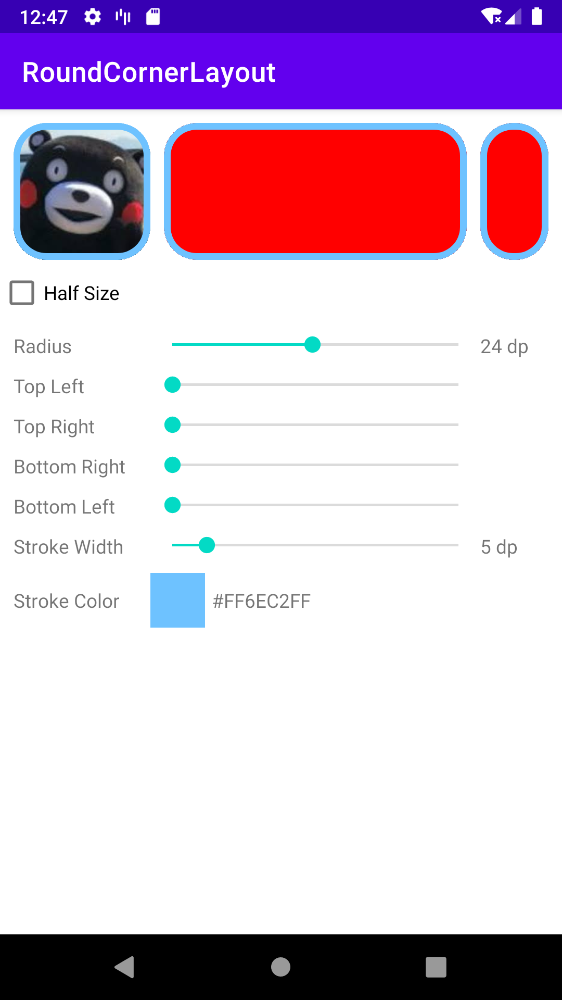

# RoundCornerLayout

一套简单通用的圆角控件




## 属性
```xml
    <!--    设置圆角半径为宽高最大值的一半-->
    <attr name="round_corner_half_size_radius" format="boolean" />
    <!--    统一设置圆角半径-->
    <attr name="round_corner_radius" format="dimension" />

    <!--    单独设置四个角的圆角半径-->
    <attr name="round_corner_top_left_radius" format="dimension" />
    <attr name="round_corner_top_right_radius" format="dimension" />
    <attr name="round_corner_bottom_left_radius" format="dimension" />
    <attr name="round_corner_bottom_right_radius" format="dimension" />

    <!--    描边颜色-->
    <attr name="round_corner_stroke_color" format="color|reference" />
    <!--    描边大小-->
    <attr name="round_corner_stroke_width" format="dimension" />
```

优先级：round_corner_half_size_radius > round_corner_x_x_radius > round_corner_radius

## 支持

* RoundCornerImageView
* RoundCornerButton
* RoundCornerTextView
* RoundCornerLinearLayout
* RoundCornerFrameLayout
* RoundCornerConstraintLayout

## 感谢
[ColorPickerView](https://github.com/skydoves/ColorPickerView) 


